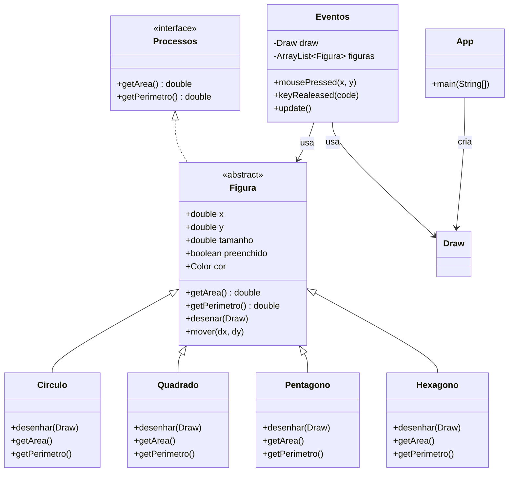

# Lista 4 - Aplicativo de desenho vetorial
Este projeto implementa uma aplicação gráfica interativa usandod a biblioteca "algs4.jar", que permite o usário desenha diferentes figuras geométricas na tela, com opção de cor, tamanho, forma e preenchimento.

## Funcionalidades
- É possível desenhar diferentes figuras geométrica utilizando os comandos do teclado.
    - Para desenhar o Círculo, utilizar a tecla **F1**.
    - Para desenhar o Quadrado, a tecla **F2**.
    - Para desenhar o Pentágono, a tecla **F3**.
    - Para desenhar o Hexágono, a tecla **F4**.
- É possível alterar as cores das figuras utilizando:
    - **F5**  para Vermelho.
    - **F6** para Laranja.
    - **F7** para Azul.
    - **F8** para Magenta.
- Para mudar as propriedades das figuras, como tamanho e preechimento:
    - A tecla **F** para alterar o preechimento.
    - As teclas **Q** e **W** para diminuir e aumentar o tamanho.
- Para limpar a tela e obter estatística:
    - A tecla **C** para limpar todas as figuras desenhadas.
    - A tecla **P** informara a soma dos perímetros de todas as figuras e a média de todas as áreas.

## Estrutura:
 - `App`: Responsável por inicializar a tela e conectar os eventos.
 - `Eventos`: Classe que implementa `DrawListener` e gerencia eventos do teclado e mouse.
 - `Figura`: Uma classe abstrata base para todas as figuras geométrica.
 - `Processos`: Uma interface que implementa as contas de área e perimétro.

## Diagrama de classe
